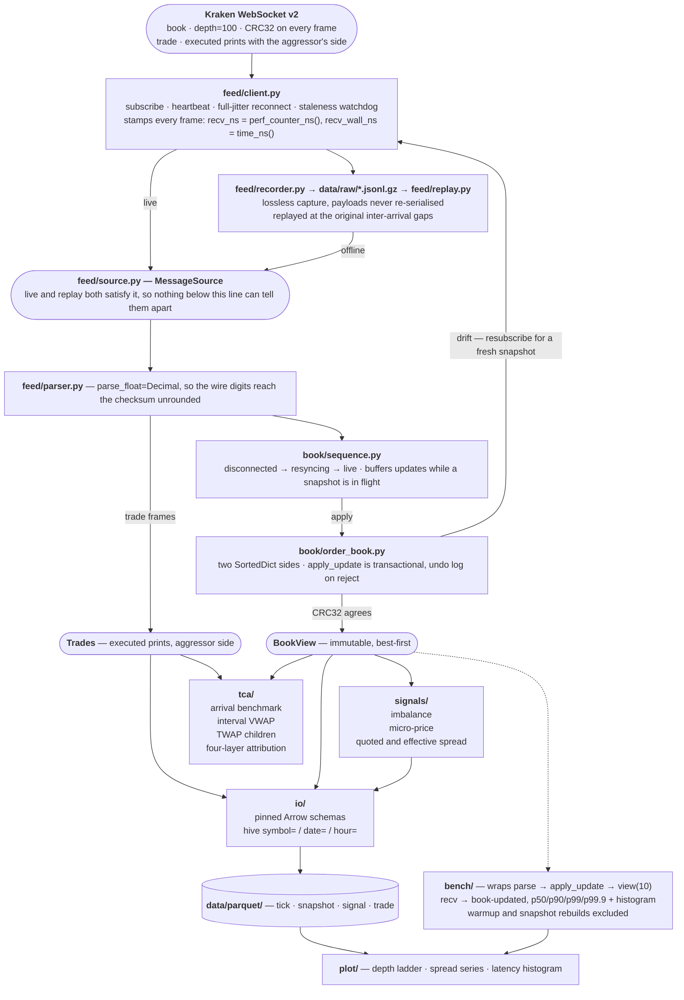

# l2-orderbook-tca

Real-time L2 order book reconstruction and execution cost analysis (TCA) from
Kraken's public WebSocket feed.

Async ingest with reconnect and staleness detection, lossless capture to JSONL,
deterministic replay, hour-partitioned Parquet storage, a latency benchmark
harness and plotting. On top of that, the part worth writing by hand: L2
reconstruction, the checksum and resynchronisation state machine, microstructure
signals, and four execution-cost measures. See [The core](#the-core).

A frame goes from socket to updated book in **25 µs** at the median, 35 µs at
the 99th, sustaining 32k updates/s on one core — measured, not estimated; see
[Results](#results).

Read-only against the exchange's public feed. There is no authenticated
endpoint, no order entry, and no broker credential anywhere in the repository.

**Want to write the algorithms yourself?** The
[`template`](https://github.com/laimax17/l2-orderbook-tca/tree/template) branch
is this repository with the four core modules removed — infrastructure complete
and green, the algorithms left as signatures, docstrings and 84 red tests, and
the design questions reopened so the decisions are yours rather than inherited.

```bash
git clone -b template https://github.com/laimax17/l2-orderbook-tca
```

---

## Architecture



Two things in that picture are the whole design, and both are easy to miss.

**Live and replay converge above the book.** `client.py` feeds the recorder and
the parser from the same stamped frames, and `replay.py` re-enters through the
same `MessageSource`. Nothing below that line — not the book, not the signals,
not the benchmark — can tell which one it is running against, so a bug seen once
on the wire can be reproduced from a file exactly, forever. Replay at `speed=0`
with the recorded timestamps kept makes a run a pure function of the capture.

**The exchange checks the reconstruction, not the author.** Kraken sends no
per-frame sequence number; what it sends is a CRC32 over the top ten levels of
each side, recomputed on every frame. The book recomputes it and compares. A
mismatch means the two books have diverged, and the only honest response is to
throw the local one away and resubscribe — which is the edge looping back to
`client.py`. This is why the results table can claim 23,602 of 23,602 frames
verified rather than "the tests pass".

## Scope

Phase one, and nothing beyond it:

| | |
|---|---|
| Exchange | Kraken public WebSocket v2 |
| Channels | `book` (`depth=100`), and `trade` with `--trades` |
| Symbol | `BTC/USD` (configurable; `XBT/USD` is accepted and normalised) |
| Storage | JSONL captures, Parquet tables |

Explicitly out of scope: multiple exchanges, live order placement, a web
frontend, a database.

## Install

```bash
uv sync                       # runtime + dev
uv sync --all-extras          # adds matplotlib for the plots
uv run pytest -m "not core"   # infrastructure suite -- green
uv run ruff check .
```

Python 3.11+.

## Quick start

No network needed for any of this except `record`:

```bash
# 1. Generate a deterministic synthetic capture (shape only — see the caveat below)
uv run l2tca synth --updates 5000 --out data/raw/synthetic.jsonl

# 2. Summarise it: frame mix, inter-arrival gaps, sequence gaps
uv run l2tca inspect data/raw/synthetic.jsonl

# 3. Replay it — unpaced, or at 10x wall clock
uv run l2tca replay data/raw/synthetic.jsonl --speed 10

# 4. Flatten it into the partitioned tick table
uv run l2tca convert data/raw/synthetic.jsonl --out data/parquet

# 5. Time recv -> book-updated, per stage, with histograms
uv run l2tca bench data/raw/synthetic.jsonl --histogram

# 6. Plot
uv run l2tca bench data/raw/synthetic.jsonl --json > bench.json
uv run l2tca plot latency --report bench.json --out latency.png
```

Capturing a live session:

```bash
uv run l2tca record --symbol BTC/USD --depth 100 --duration 600
```

writes `data/raw/kraken_book_BTC-USD_d100_<timestamp>.jsonl`. Captures are
gitignored; they are data, not source.

Human-readable output goes to stdout, structured events to stderr as JSON:

```bash
uv run l2tca record --duration 600 > summary.txt 2> events.jsonl
```

## Package map

| Package | Status | What it does |
|---|---|---|
| `feed/` | complete | WS client, reconnect, staleness watchdog, parsing, capture, replay |
| `io/` | complete | Arrow schemas, hour-partitioned Parquet writer, validating Polars readers |
| `bench/` | complete | recv → book-updated timing, percentiles, histograms |
| `plot/` | complete | Depth ladder, spread series, latency histogram |
| `cli/`, `logging.py`, `config.py` | complete | Commands, JSON logging, configuration |
| `book/order_book.py` | complete | L2 reconstruction, transactional updates, depth trimming |
| `book/sequence.py` | complete | CRC32 integrity and resynchronisation state machine |
| `signals/microstructure.py` | complete | Imbalance, micro-price, quoted and effective spread |
| `tca/analysis.py` | complete | Arrival benchmark, interval VWAP, child orders, attribution |

## The core

`book/`, `signals/` and `tca/` are the algorithms — everything else in the
repository exists so that they can be run against a real recording and
benchmarked the same minute they are written.

The repository was built stubs-first for exactly that reason: the surrounding
infrastructure was finished, and the four core modules shipped as signatures,
complexity targets and a red test suite before a line of their bodies existed.
[`docs/CORE.md`](docs/CORE.md) records the design decisions each one rests on
and why they went the way they did.

```bash
uv run pytest                  # everything
uv run pytest -m core          # the 81 tests over the hand-written modules
uv run pytest -m "not core"    # the 120 infrastructure tests
```

The `core` marker survives because it is still the useful cut while working on
one of those modules. There is deliberately no marker filter in `addopts`: a
filter there applies to every invocation, including the explicit node ids an IDE
passes when you click a single test, which silently deselects it instead of
running it.

What the core does:

| | |
|---|---|
| `OrderBook` | Two `SortedDict` sides. `apply_update` is transactional — an undo log rolls the frame back whole if it would leave the book crossed, so a rejected frame never leaves a half-applied state. |
| `SequenceTracker` | Kraken sends no per-frame sequence number, so integrity rests on the CRC32 the exchange computes over the top ten levels of each side. The tracker recomputes it, and drives the disconnected → resyncing → live transitions, buffering updates while a replacement snapshot is in flight. |
| `microstructure` | Order book imbalance, micro-price (with the crossed weighting — size on the far side pulls the price toward the near one), quoted spread, effective spread. |
| `analysis` | Arrival benchmark at the decision instant, interval VWAP, a TWAP child-order simulator that walks the opposite side, and a four-layer shortfall attribution that sums to the total by construction. |

## Results

From one BTC/USD recording at depth 100: **598.9 s, 24,203 frames** (23,602
updates, 1 snapshot, 40.4 frames/s), replayed with the first 500 frames dropped
as warmup and snapshot rebuilds excluded.

Machine: **Apple Silicon (arm64), macOS 26.4.1, CPython 3.14.7.** Latency
numbers are meaningless without it, which is why every report carries its own
environment block.

| | |
|---|---|
| recv → book-updated, p50 / p99 / p99.9 | **24.96 / 35.50 / 75.33 µs** (max 175.29) |
| `apply_update`, p50 / p99 | **4.38 / 8.79 µs** (max 65.58) |
| `view(10)`, p50 / p99 | **13.75 / 16.63 µs** (max 98.63) |
| `apply_snapshot`, 100 levels a side | **448.75 µs**, once per connection |
| Sustained throughput | **32,155 updates/s** — 23,602 in 0.734 s of wall clock |
| Checksum verification rate | **23,602 / 23,602 (100.00%)**, 0 sequence gaps |
| Internal representation A/B (dict vs sorted vs tick array) | not measured — see below |
| Capture size, 10 minutes at depth 100 | **7.8 MB** JSONL, ≈13.7 KB/s, ≈47 MB/hour; **10.4×** smaller gzipped |

Reproduce with `uv run l2tca bench <capture> --warmup 500 --histogram` and
`uv run l2tca inspect <capture> --verify`. Every update frame in the capture was
replayed into the book and checked against the CRC32 Kraken computed over the
top ten levels of each side — ten minutes of continuous incremental
reconstruction with no drift, attested by the exchange's own ledger rather than
by hand-written expectations. Without a capture of your own, the same command
over `tests/fixtures/sample.jsonl.gz` reruns it on the opening 143 s
(4852 / 4852).

**Two things worth reading off that table.**

`view(10)` costs **3.1×** what `apply_update` does — 13.75 µs against 4.38 µs.
Taking the top ten levels out of the book is three times more expensive than
maintaining it, which is not where the cost was expected to be, and it is the
first thing to attack: the book is updated once per frame but read once per
frame too, so it is more than half of the end-to-end path.

Parsing costs **1.4×** an update — 6.29 µs against 4.38 µs. That is the price of
`parse_float=Decimal`, paid so the wire digits survive exactly into the checksum.
Floats would be faster and would silently break integrity checking, so the
trade is deliberate; it is worth knowing it is the second-largest term.

The representation A/B is the one row here that is not a measurement but a
project: it means writing the book a second and third way (a plain dict sorted
on read, a fixed tick array indexed by price level) and benchmarking all three.
Left undone rather than guessed at.

## Design decisions

Reasoning in more detail lives in the module docstrings.

**Two clocks on every frame.** `time.perf_counter_ns()` is monotonic and immune
to NTP steps, so it is the only clock used for latency arithmetic; it has no
epoch, so it means nothing across processes. `time.time_ns()` is comparable
against exchange timestamps but can jump. Both are stamped at receipt, and the
capture header pairs them once so a recording's monotonic stamps can be anchored
to wall clock after the fact.

**Prices are `Decimal`; floats appear only at the Parquet boundary.** Kraken's
book checksum is computed over the exact digits the exchange sent, so a round
trip through binary float can make a correct implementation report corruption.
Price levels are also dictionary keys, where float drift is a correctness bug
rather than a display bug.

**Capture is lossless and replay is deterministic.** Frames are recorded as the
exact text received, never re-serialised. Replay defaults to the recorded
timestamps and no pacing, which makes every downstream result a pure function of
the file. `--speed` scales the recorded gaps when wall-clock behaviour is what is
being tested.

**Recordings show their own gaps.** Connect, disconnect and reconnect are written
into the capture as `control` records. A replay that silently glossed over a
two-second reconnect would look like a clean session and quietly invalidate any
staleness analysis run on it.

**Full jitter on reconnect.** Delays are `uniform(0, min(cap, base * 2^n))`
rather than the exponential value itself. After a venue-wide outage every client
reconnects at once; an unjittered schedule keeps the endpoint down.

**A ping before declaring a connection dead.** Kraken heartbeats at least once a
second, so silence is diagnostic — but a half-open TCP connection looks
identical to an idle one until you write to it. The first silent window buys one
application-level ping; only the second declares the connection dead.

**Hour-partitioned Parquet with pinned Arrow schemas.** Inferred schemas drift —
an all-null column is `null` type one hour and `double` the next, and the two
files stop scanning together. `schema_version` lives in the rows, not just the
path, so it survives a file being copied.

**Tail latency, not mean.** Every sample is kept, and percentiles are
nearest-rank so a reported `p99` is a latency that actually occurred. Warmup and
snapshot rebuilds are excluded from the update distribution: the first frames
pay for interpreter warmup, and a rebuild is a different operation with a
different cost.

## Synthetic data caveat

`l2tca synth` produces frames with the right *shape* — snapshot then incremental
updates, deletes, heartbeats — from a seeded RNG, so the plumbing can be
exercised without a network. The price process is a lazy random walk and the
depth profile is arbitrary. **Nothing it produces has market meaning.** Use a
real capture for anything with a conclusion attached.

Synthetic frames deliberately carry no `checksum` field: fabricating one would
require the very CRC32 implementation it is meant to validate, and a
self-consistent fake would confirm a wrong implementation against itself.

Tests that need real data look for `tests/fixtures/sample.jsonl` and skip when it
is absent. Record one and commit a trimmed slice to activate them.

## Layout

```
src/l2tca/
  feed/      WS client, reconnect, parsing, JSONL capture, replay
  book/      order book core + resync state machine   [core]
  signals/   microstructure factors                   [core]
  tca/       execution cost analysis                  [core]
  io/        Arrow schemas, Parquet writer/reader
  bench/     latency harness
  plot/      figures over stored Parquet
  cli/       subcommands
tests/
  factories.py   test data factory
  fixtures/      a recorded sample goes here
  test_order_book.py test_sequence.py
  test_microstructure.py test_analysis.py   ← the core suite (`-m core`)
data/raw/    captures (gitignored)
notebooks/
docs/CORE.md
```

Packages live under a single `l2tca/` distribution package rather than as
top-level `feed/`, `book/`, `io/`: a top-level `io` package is unimportable,
because the standard library's is already in `sys.modules` before any path entry
is consulted.

## License

MIT.
